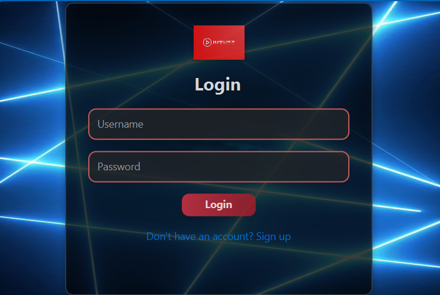
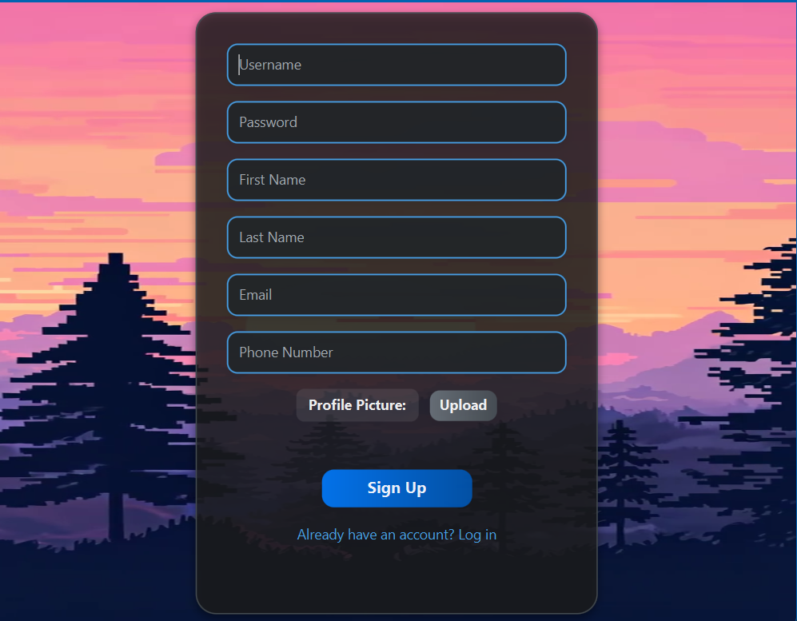
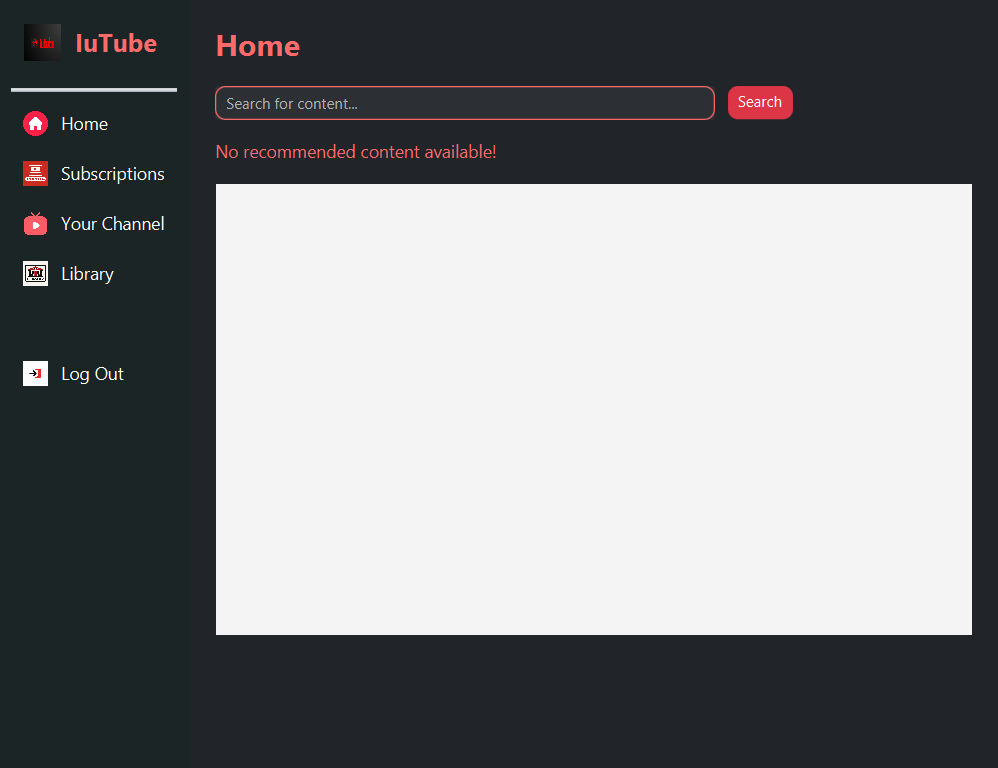
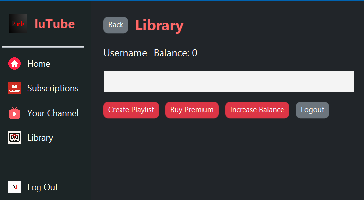
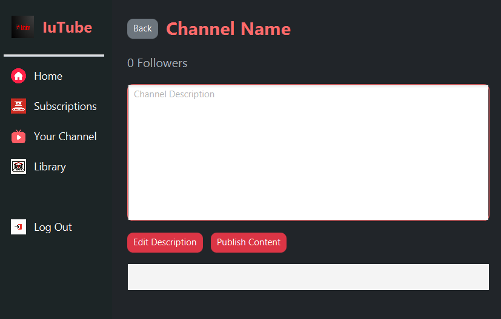
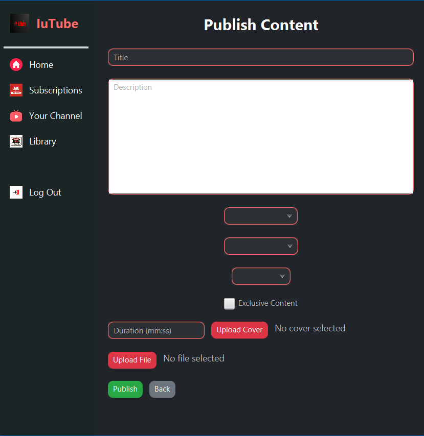
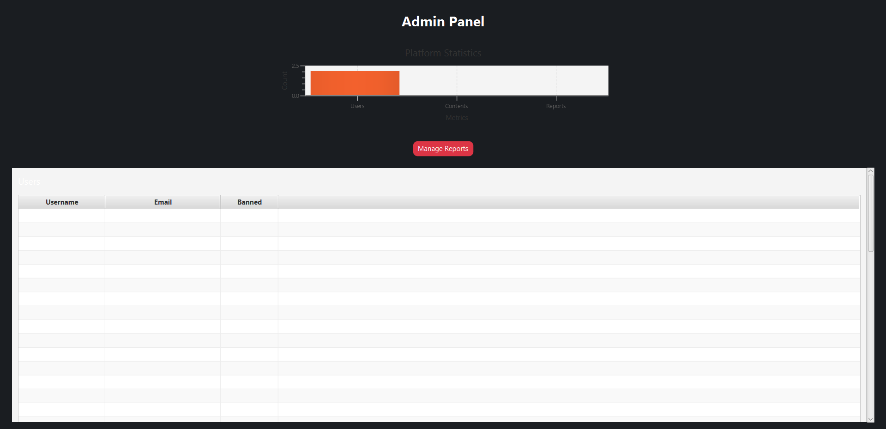

# 🎬 YouTube-AP

A JavaFX-based YouTube clone built for the **Advanced Programming** course at the **University of Isfahan**.  
Implements an MVC architecture with features such as video management, playlists, and user interactions.

---

## 🚀 Features
- 🎥 Watch, upload, and manage videos  
- 🧑‍💻 User authentication (login/signup)  
- 📺 Create and manage playlists (Liked, Watch Later, custom lists)  
- 💬 Comment, like, and report videos  
- 🧠 Admin panel for content moderation and user management  
- 🔎 Search, filter, and content recommendation  
- 🎨 JavaFX UI with FXML-based layouts

---

## 🧩 Tech Stack
| Layer    | Technology                       |
|----------|----------------------------------|
| UI       | JavaFX, FXML                     |
| Logic    | Java (MVC pattern)               |
| Database | (via Database singleton)   |
| Build    | Maven                             |
| IDE      | IntelliJ IDEA                     |

---

## 📂 Project Structure


YouTube-AP/
├── README.md
├── src/
│ └── main/java/... (Model, View, Controller)
├── screenshots/ (all UI images)
├── pom.xml
├── mvnw, mvnw.cmd
└── .gitignore


---

## 🧠 How It Works (Overview)
The project follows the **Model–View–Controller (MVC)** architecture:

- **Model:** Domain classes (Content hierarchy, Account/User types, Playlist, Channel, Comment, Report, Database singleton).  
- **View:** JavaFX + FXML scenes and assets.  
- **Controller:** Handles user actions, business logic (playback, search, recommendation, admin operations).  

**Key behaviors:** polymorphism for content and users, singleton `Database` for all data access, role-based behavior (NormalUser vs PremiumUser), and admin moderation tools.

---

## 🖼️ Screenshots / Demo

<p align="center">
  
  
</p>

<p align="center">
  
  
</p>

<p align="center">
  
  
</p>

<p align="center">
  
</p>

---

## ⚙️ Requirements
- Java 17+ (or the Java version your project targets)  
- JavaFX SDK compatible with your Java version (or use Maven dependencies for JavaFX)  
-  project can run with in-memory/sample data 

---

## ▶️ How to Run (local dev)
1. Clone the repository:
   ```bash
   git clone https://github.com/alizn7/YouTube-AP.git
   cd YouTube-AP
   
Build with Maven:
mvn clean install
Run the application:
mvn javafx:run


